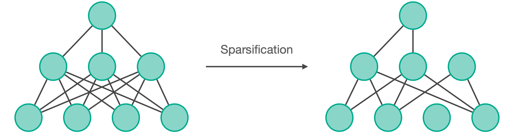
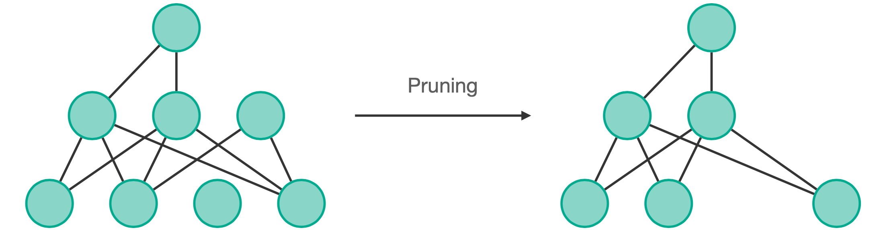
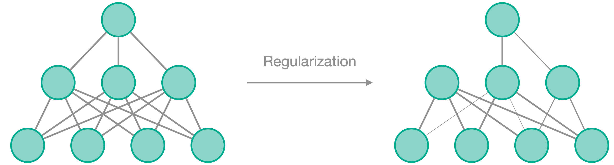
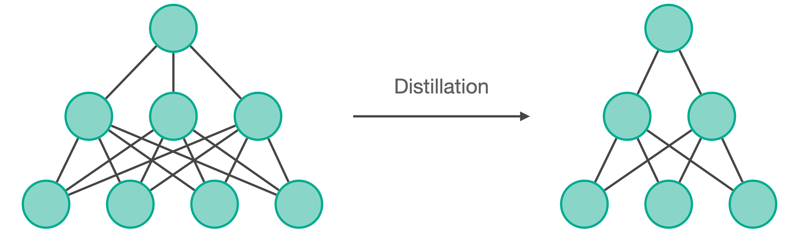
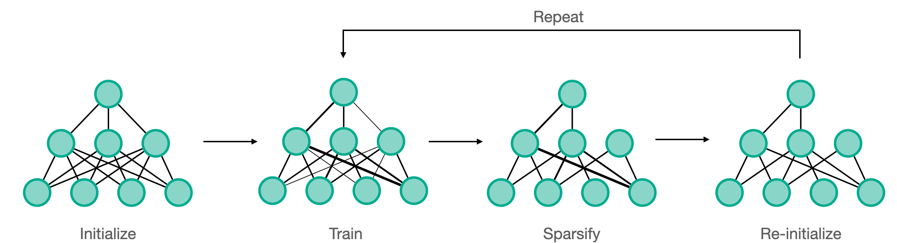

# Fasterai


<p align="center">
    <a href="https://pypi.org/project/fasterai/"></a>
    <a href="https://pypi.org/project/fasterai/"></a>
    <a href="https://opensource.org/licenses/MIT"></a>
    <a href="https://pypi.org/project/fasterai/"></a>
</p>


<p align="center">
  <a href="#methods">Methods</a> •
  <a href="#features">Features</a> •
  <a href="#installation">Installation</a> •
  <a href="#tutorials">Tutorials</a> •
  <a href="#citing">Citing</a> •
  <a href="#license">License</a>
</p>

`fasterai` is a library created to make neural network **smaller** and **faster**. It essentially relies on common compression techniques for networks such as pruning, knowledge distillation, Lottery Ticket Hypothesis, ...

The core feature of `fasterai` is its Sparsifying capabilities, constructed on 4 main modules: **granularity**, **method**, **criteria**, **schedule**. Each of these modules is highly customizable, allowing you to change them according to your needs or even to come up with your own !

## Project Documentation

Visit [Read The Docs Project Page](https://nathanhubens.github.io/fasterai/) or read following README to know more about using `fasterai`.

---

##  Features

### 1. Sparsifying



Make your model sparse (*i.e.* prune it) according to a:
- <b>Sparsity: </b> the percentage of weights that will be replaced by 0
- <b>Granularity: </b> the granularity at which you operate the pruning (removing weights, vectors, kernels, filters)
- <b>Method: </b> prune either each layer independantly (local pruning) or the whole model (global pruning)
- <b>Criteria: </b> the criteria used to select the weights to remove (magnitude, movement, ...)
- <b>Schedule: </b> which schedule you want to use for pruning (one shot, iterative, gradual, ...)

This can be achieved by using the `SparsifyCallback(end_sparsity, granularity, method, criteria, sched_func)`

### 2. Pruning



Once your model has useless nodes due to zero-weights, they can be removed to not be a part of the network anymore.

This can be achieved by using the `Pruner()` method

### 3. Regularization



Instead of explicitely make your network sparse, let it train towards sparse connections by pushing the weights to be as small as possible.

Regularization can be applied to groups of weights, following the same granularities as for sparsifying, i.e.:
- <b>Granularity: </b> the granularity at which you operate the regularization (weights, vectors, kernels, filters, ...)

This can be achieved by using the `RegularizationCallback(granularity)`

### 4. Knowledge Distillation



Distill the knowledge acquired by a big model into a smaller one, by using the `KnowledgeDistillation` callback.

### 5. Lottery Ticket Hypothesis



Find the winning ticket in you network, *i.e.* the initial subnetwork able to attain at least similar performances than the network as a whole.

---

##  Quick Start

### 0. Import fasterai

```python
from fasterai.sparse.all import *
```

### 1. Create your model with fastai

```python
learn = cnn_learner(dls, model)
```

### 2. Get you Fasterai Callback

```python
sp_cb=SparsifyCallback(end_sparsity, granularity, method, criteria, sched_func)
```

### 3. Train you model to make it sparse !

```python
learn.fit_one_cycle(n_epochs, cbs=sp_cb)
```

---

##  Installation


```
pip install git+https://github.com/nathanhubens/fasterai.git
```

or 

```
pip install fasterai
```

---

## Tutorials

- [Get Started with FasterAI](https://nathanhubens.github.io/fasterai/tutorial.using_fasterai.html)
- [Create your own pruning schedule](https://nathanhubens.github.io/fasterai/tutorial.schedules.html)
- [Find winning tickets using the Lottery Ticket Hypothesis](https://nathanhubens.github.io/fasterai/tutorial.lottery_ticket.html)
- [Use Knowledge Distillation to help a student model to reach higher performance](https://nathanhubens.github.io/fasterai/tutorial.knowledge_distillation.html)
- [Sparsify Transformers](https://nathanhubens.github.io/fasterai/tutorial.transformers.html)
- More to come...

---

##  Citing
```
@software{Hubens,
  author       = {Nathan Hubens},
  title        = {fasterai},
  year         = 2022,
  publisher    = {Zenodo},
  version      = {v0.1.6},
  doi          = {10.5281/zenodo.6469868},
  url          = {https://doi.org/10.5281/zenodo.6469868}
}
```

---

## License

[Apache-2.0](https://www.apache.org/licenses/) License.


